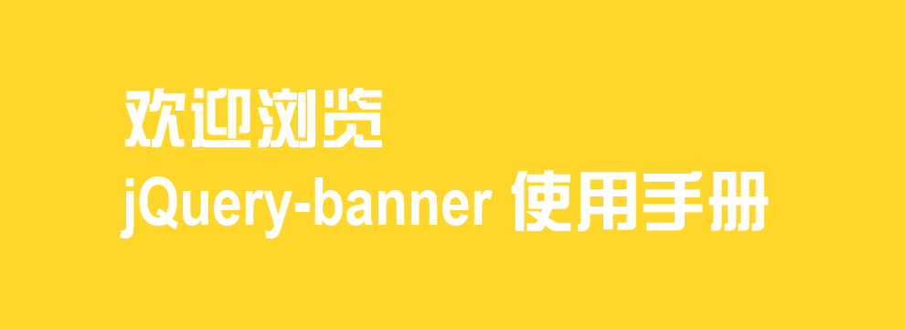

## jQuery-banner使用手册
**当前版本： V2.3.0 developer**

### jQuery-banner是什么
>jQuery-banner是一款基于jQuery库开发的轻量级轮播插件，方便开发者快速完成针对页面轮播效果的开发，并获得不同的轮播效果。例如，水平滑动或垂直滑动，以及淡出淡入或切换等！（适用于常规banner、照片大图预览幻灯片切换效果、滚屏效果等）此插件的当前版本为 V2.3.0 开发者版。

### 具体参数列表

| 参数名称 | 参数变量 | 参数取值 | 参数说明 |
|-----------|------------|------------|------------|
| 动画方向          |`dir`        |'[left]' / '[right]' / '[up]' / '[down]'      |控制图片切换的方向，当动画效果中不带方向性，本参数无效，参数为空时：默认值为 *left*
| 动画效果          |`effect`     |'[fade]' / '[cut]'    				 		|控制图片效果的参数，参数可为字符串，即所有图片切换均使用该效果，也可传递数组，数组内的参数将依次作为对应图片的切换效果，参数为空时：默认值为 *defaults*
| 动画事件          |`event`      |'[btn]' / '[arrow]' / '[wheel]' / '[keyborad]'|添加能控制图片切换的事件小姑，参数可为字符串，即将当前事件添加，也可以传递数组，即将数组内所有事件添加，参数为空时： 默认值为 *['btn','arrow']*
| 间隔时间          |`intervel`   |'[slow]' / '[medium]' / '[fast]' / '[number]' |控制动画的执行间隔，本参数为空时：默认值为 *medium* 即 *3000ms*  
| 动画速度          |`speed`      |'[slow]' / '[medium]' / '[fast]' / '[number]' |控制动画的执行速度，本参数为空时：默认值为 *medium* 即 *600ms*，**ps:当动画速度大于间隔时间时，会报错**    
| 是否自动播放       |`auto`      |[true] / [false]  								|控制动画是否自动播放，本参数为空时：默认值为 *true*	
| 是否循环          |`cycle`      |[true] / [false]  							|控制动画是否循环播放，本参数为空时：默认值为 *true*	
| 焦点按钮样式命名   |`btnCls`     |[焦点按钮盒子] / [焦点按钮] / [焦点按钮选中样式]	|控制焦点按钮的样式，本参数为空时：默认值为 *['jquery-bannerPoint-box', 'jquery-bannerPoint', 'jquery-bannerPoint-point', 'jquery-bannerPoint-hover']*	
| 左右控件样式命名   |`arrowCls`   |[箭头盒子] / [左箭头] / [右箭头]					|控制左右控件的样式，本参数为空时：默认值为 *['jquery-bannerBtn', 'jquery-bannerBtn-left', 'jquery-bannerBtn-right']*
| 是否添加默认箭头样式|`arrowStyle`|[true] / [false]								|控制左右控件是否添加<>样式，本参数为空时： 默认值为：*true*


### 引入库文件
--此插件基于jQuery开发
```HTML
<script src="js/jquery-11.1.1.min.js"></script>
<script src="js/jquery-banner.2.3.0.min.js"></script>
<link href="css/jquery-banner.css" rel="stylesheet" type="text/css">
```	

### HTML代码片段
--页面上必须的html代码，保证外层框架结构相同，标签不限，内层结构不限，id名不限
```HTML
<div id='selector'>
	<ul>
		<li><a href="#"></a></li>
		<li><a href="#"></a></li>
		<li><a href="#"></a></li>
	</ul>
</div>
```

### 调用插件
--参数可为空，全部参数请参考列表；可多次调用
```html
	// 使用html5 datashu'xing属性进行传参,优先级大于js传参 
	
	<div id="banner" data-param='{"effect":"fade","interval":3000}'></div>
```

```javascript
<script type="javascript">
    <!--
        $('#banner1').banner('fade',3000,600) //效果 间隔时间 运行速度 
		$('#banner2').banner('left','fast','medium') //方向 间隔时间 运行速度

        /* 或使用对象传参 */

        $('#banner3').banner({
            effect : 'fade' ,
            interval : 3000 ,
            speed : 600 ,
            auto : true ,//默认自动
            cycle : true//默认循环
        })
		$('#banner4').banner({
            effect : ['fade','defaults','fade'],
			event : ['btn','arrow','wheel'] ,
            interval : 3000 ,
            speed : 600 ,
            auto : true ,//默认自动
            cycle : true//默认循环
        })
    -->
</script>
```

### 提供的css选择器
--自定义样式时请带上外层父级id，避免同一页面多个组件样式冲突
```css
.jquery-bannerImg  /* banner外层框架 */
.jquery-bannerImg-images  /* banner的运动层 */
.jquery-bannerBtn  /* banner左右控件的盒子 */
.jquery-bannerBtn-left  /* banner的向左控件 */
.jquery-bannerBtn-right  /* banner的向右控件 */
.jquery-bannerPoint  /* banner的焦点按钮盒子 */
.jquery-bannerPoint-point  /* banner的焦点按钮 */
.jquery-bannerPoint-hover  /* 控制banner的焦点按钮选中时的样式 */
```

### 自定义效果函数和事件函数
--此版本为开发者版，提供接口为开发者自行添加动画效果和事件监听

**1.提供参数说明**

| 参数名称 | 参数变量 | 参数说明 |
|-----------|------------|------------|
| param | `speed` `interval` `auto` `cycle` | 使用时为this.param.variable(比如：param.speed) param可调用的参数即为参数列表内的参数 |
| img |  | 轮播图的图片对象，使用时为this.img |
| obj |  | 轮播图对象，使用时为this.obj |

| 参数名称 | 参数变量 | 参数说明 |
|-----------|------------|------------|
| status | `cPoint` | 此参数表明下一张进入的图片的编号，调用this.status.cPoint |
| status | `sPoint` | 此参数表明当前图片的编号，调用this.status.sPoint |
| status | `flag` | 此参数表明能否进行下一个动画效果（即当前动画是否已经执行完），是为`true`，不是为`false`，调用this.status.flag |
| status | `moushH` | 此参数表明鼠标是否进入轮播图对象内部，是为`true`，不是为`false`，调用this.status.mouseH |

**2.调用接口**
```javascript
/*调用接口时，推荐使用需要操作的轮播图对象进行*/
var k=$('.banner').bannerTool();

/*
*调用添加动画的函数
*param1为动画效果名称，此处填写的名称将用于调用时的effect参数
*param2为function，即具体动画效果
*/

k.addEffect(param1,param2)

/*该示例为添加淡入淡出的效果*/

k.addEffect('fade',function(){
	this.img.eq(this.status.cPoint).css({zIndex:35,display:'none'}).fadeIn(this.param.speed);
})

/*
*调用添加事件监听的函数
*param1为事件名称，此处填写的名称将用于调用时的event参数
*param2为function，即具体事件函数
*/

k.addEvent(param1,param2)

/*
*该示例为添加滚轮的事件监听
*监听后的结果为改变status.cPoint的值(下一张即为：status.cPoint++,反之，status.cPoint++)
*而后调用this.obj.bannerExcute()即可
*推荐将所有提供的变量保存为局部变量，比如 var me = this.obj; var param = this.param;
*/
k.addEvent('wheel',
function() {
    var me = this.obj,
    status = this.status;
    param = this.param;
    me.on('mousewheel DOMMouseScroll',
    function(e) { //添加滚轮事件
        if (status.flag && status.mouseH) {
            e.preventDefault();
            var delta = (e.originalEvent.wheelDelta && (e.originalEvent.wheelDelta > 0 ? 1 : -1)) || // chrome & ie
            (e.originalEvent.detail && (e.originalEvent.detail > 0 ? -1 : 1)); // firefox   
            if (delta > 0) {
                status.cPoint--;
            } else if (delta < 0) {
                status.cPoint++;
            }
            me.bannerExcute();

        }
    });
})
```

© 本手册由 磨盘兄弟 @lzmoop 官方提供 www.lzmoop.com
